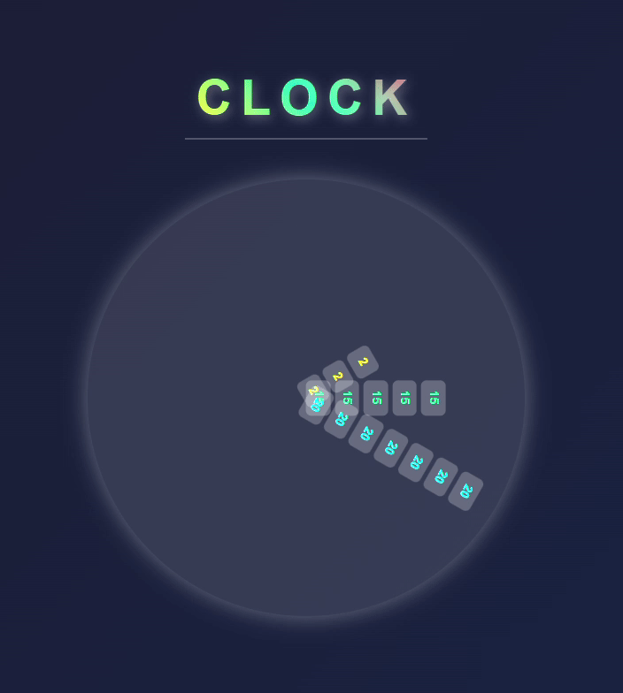

# Stack-Clock


## 🪟Overview
A modern, visually appealing clock implementation that displays time using a unique stacking animation technique. The clock features a circular design with three dynamic hands (hour, minute, second) that rotate and display time values through stacked number elements.

## ⭕ Supports On 
  <br>
  <a href="https://github.com/GitSquared/edex-ui/releases/download/v2.2.8/eDEX-UI-Windows.exe" target="_blank"></a>
  <a href="https://github.com/GitSquared/edex-ui/releases/download/v2.2.8/eDEX-UI-macOS.dmg" target="_blank"></a>
  <a href="https://github.com/GitSquared/edex-ui/releases/download/v2.2.8/eDEX-UI-Linux-x86_64.AppImage" target="_blank"></a>
  <a href="https://github.com/GitSquared/edex-ui/releases/download/v2.2.8/eDEX-UI-Android.apk" target="_blank"></a>
  <br>


## 📚TechStack


## 🌲Project Structure 

Here is the folder structure of this app.

```bash
Stack-Clock/
  |- .github/
    |-- workflows/
      |--- static.yml 
  |- README.md
  |- index.html
  |- styles.css
  |- script.js    
  |- output.gif  
  |- favicon.png    
```
  
## 🏃‍♂️‍➡️ How to Run
Clone this repository:

```bash
git clone https://github.com/yugeshsivakumar/Stack-Clock.git
```
Navigate to the project directory:

```bash
cd Stack-Clock
```

## ✨ Results
After running index.html, navigate to http://localhost:5500/ to visulaize the clock. 



## 📩 Contact

Feel free to reach out to me:

**Contact Form**: https://forms.gle/gbnD57wG6oRVJ3aT8

**Project Link**: https://github.com/yugeshsivakumar/Stack-Clock

**Hosted Website**: https://yugeshsivakumar.github.io/Stack-Clock/

**My Website**: https://yugesh.me


## 🛂 Contributing
If you'd like to contribute to this project, please fork the repository and create a pull request with your proposed changes.

1. Fork the Project
    - Click on the 'Fork' button on the top right corner of this repository's page
   
2. Create your Feature Branch 
```bash
git checkout -b feature/AmazingFeature
```
3. Commit your Changes 
```bash
git commit -m 'Add some AmazingFeature'
```
4. Push to the Branch
```bash
git push origin feature/AmazingFeature
```
5. Open a Pull Request
   - Go to your forked repository on GitHub and click on 'New Pull Request'.
   - Fill out the Pull Request form with details about your proposed changes.

## 🔑 License

This portfolio is licensed under the MIT License. See the [LICENSE](LICENSE) file for details.


